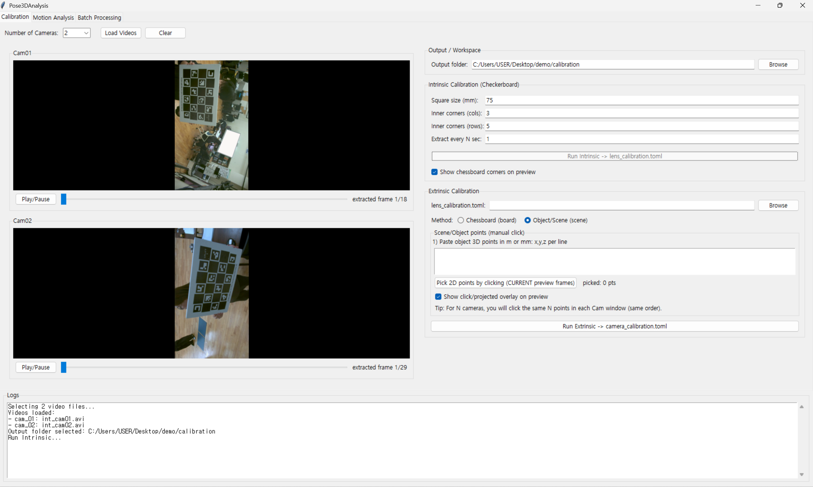
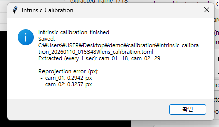
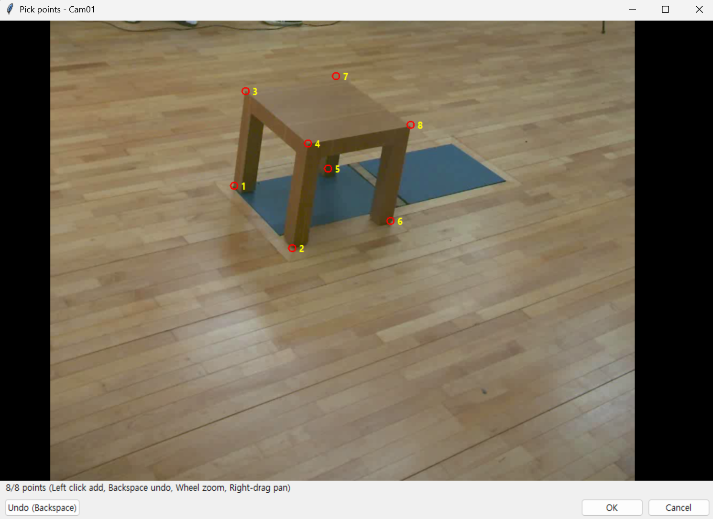
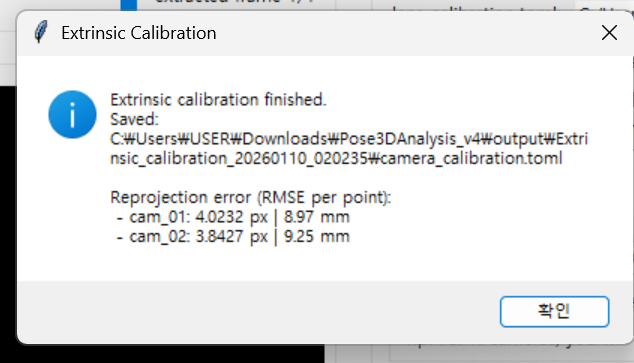
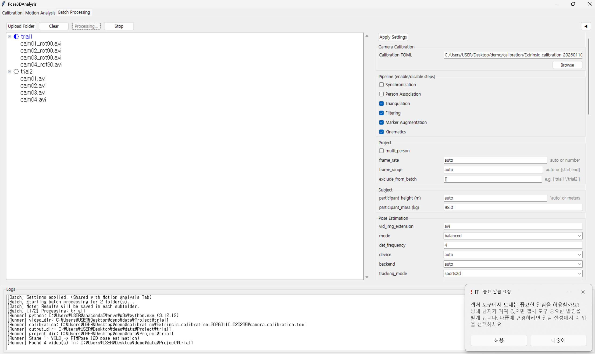
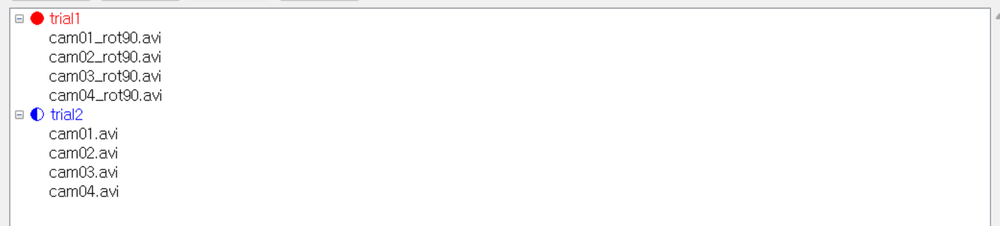
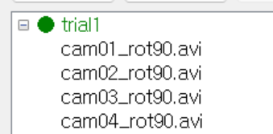

# Pose3DAnalysis

## 개요

이 프로젝트는 Pose2Sim 을 GUI 기반으로 이용하기 위해 만들어졌음

## 디렉토리 구조

```
Pose3DAnalysis_v4/
├── app.py                          # 메인 엔트리 포인트 (루트에서 실행)
├── src/                            # 소스 코드 (새로 추가)
│   └── pose3danalysis/             # 메인 패키지
│       ├── __init__.py
│       ├── __main__.py             # 모듈 실행 엔트리 포인트
│       ├── core/                   # 핵심 기능 모듈
│       │   ├── __init__.py
│       │   ├── calib_io.py         # 캘리브레이션 I/O
│       │   ├── frame_extract.py    # 프레임 추출
│       │   ├── point_picker.py     # 포인트 선택
│       │   ├── utils.py            # 유틸리티 함수
│       │   ├── video.py            # 비디오 처리
│       │   └── zoom_preview.py     # 줌 프리뷰
│       ├── gui/                    # GUI 모듈
│       │   ├── __init__.py
│       │   ├── main_app.py         # 메인 앱
│       │   ├── tabs/               # 탭 모듈
│       │   │   ├── __init__.py
│       │   │   ├── calibration_tab.py
│       │   │   ├── motion_analysis_tab.py
│       │   │   └── batch_processing_tab.py
│       │   ├── components/         # GUI 컴포넌트
│       │   │   ├── __init__.py
│       │   │   ├── calibration_preview.py
│       │   │   ├── multicam_preview.py
│       │   │   ├── scrollable_frame.py
│       │   │   ├── side_settings_panel.py
│       │   │   └── viewer3d_panel.py
│       │   ├── calibration/        # 캘리브레이션 관련 모듈
│       │   │   ├── __init__.py
│       │   │   ├── camera_state.py
│       │   │   ├── extrinsic_processor.py
│       │   │   ├── intrinsic_processor.py
│       │   │   ├── preview_renderer.py
│       │   │   └── session_manager.py
│       │   └── utils/              # GUI 유틸리티
│       │       ├── __init__.py
│       │       ├── calibration_utils.py
│       │       ├── helpers.py
│       │       ├── logging_utils.py
│       │       ├── motion_settings.py
│       │       ├── pose_utils.py
│       │       └── video_utils.py
│       └── runner/                 # 실행 관련 모듈
│           ├── __init__.py
│           ├── config_builder.py
│           └── pose2sim_runner.py
├── Pose2Sim/                       # Pose2Sim 라이브러리 (외부, 필요한 경우 일부 수정하였음)
├── models/                         # 모델 파일 (기존의 방식은 Fine-Tuning 한 모델을 사용하기 힘들었는데 Local 부분에 업로드해서 본인의 모델을 사용하기 용이하게 함)
├── docker/                         # Docker 설정
├── tests/                          # 테스트
│   ├── __init__.py
│   └── test_helpers.py
├── pyproject.toml                  # 프로젝트 설정
└── README.md                       # 프로젝트 문서
```

### 1. Installation

#### 가상환경 설치

```bash
conda create --name p3a python=3.12 -y
conda activate p3a
```

#### Opensim Package 다운로드

```bash
conda install -c opensim-org opensim -y
```

#### Pytorch 설치

```bash
# ROCM 6.1 (Linux only)
pip install torch==2.4.0 torchvision==0.19.0 torchaudio==2.4.0 --index-url https://download.pytorch.org/whl/rocm6.1
# CUDA 11.8
pip install torch==2.4.0 torchvision==0.19.0 torchaudio==2.4.0 --index-url https://download.pytorch.org/whl/cu118
# CUDA 12.1
pip install torch==2.4.0 torchvision==0.19.0 torchaudio==2.4.0 --index-url https://download.pytorch.org/whl/cu121
# CUDA 12.4
pip install torch==2.4.0 torchvision==0.19.0 torchaudio==2.4.0 --index-url https://download.pytorch.org/whl/cu124
# CPU only
pip install torch==2.4.0 torchvision==0.19.0 torchaudio==2.4.0 --index-url https://download.pytorch.org/whl/cpu
```

### 2. 실행 방법

#### 방법 1: 설치 후 실행

```bash
pip install -e .
pose3danalysis
```

#### 방법 2: 모듈로 실행

```bash
pip install -e .
python -m pose3danalysis
```

### Docker 사용 방법

#### GPU Version

```bash
# Build GPU image
docker build -f docker/Dockerfile.gpu -t pose3danalysis:gpu .

# Run GPU container
docker run --gpus all --shm-size 16g -it --rm \
  -e DISPLAY=$DISPLAY \
  -v /tmp/.X11-unix:/tmp/.X11-unix \
  -v /mnt/c/Users/USER/Desktop/demo:/demo \ # project directory
  -v "$PWD":/app \
  pose3danalysis:gpu

# Run GPU container with bash
docker run --gpus all --shm-size 16g -it --rm \
  -e DISPLAY=$DISPLAY \
  -v /tmp/.X11-unix:/tmp/.X11-unix \
  -v /mnt/c/Users/USER/Desktop/demo:/demo \ # project directory
  -v "$PWD":/app \
  pose3danalysis:gpu bash
```

#### CPU Version

```bash
# Build CPU image
docker build -f docker/Dockerfile.cpu -t pose3danalysis:cpu .

# Run CPU container
docker run --shm-size 16g -it --rm \
  -e DISPLAY=$DISPLAY \
  -v /tmp/.X11-unix:/tmp/.X11-unix \
  -v /mnt/c/Users/USER/Desktop/demo:/demo \
  -v "$PWD":/app \
  pose3danalysis:cpu

# Run CPU container with bash
docker run --shm-size 16g -it --rm \
  -e DISPLAY=$DISPLAY \
  -v /tmp/.X11-unix:/tmp/.X11-unix \
  -v /mnt/c/Users/USER/Desktop/demo:/demo \
  -v "$PWD":/app \
  pose3danalysis:cpu bash
```

## GUI 사용법

### 1. Calibration (캘리브레이션)



Calibration 탭에서는 다중 카메라의 내부 파라미터(Intrinsic)와 외부 파라미터(Extrinsic)를 설정할 수 있습니다.

#### 1.1 카메라 내부 파라미터 (Intrinsic Calibration)

1. **Output folder 설정**: 캘리브레이션 결과가 저장될 폴더를 선택합니다.
2. **Camera 개수 선택**: 사용할 카메라 개수를 선택합니다 (2~8개).
3. **Load Videos**: 각 카메라의 비디오 파일을 업로드합니다.
4. **Chessboard 설정 입력**:
   - Square size (mm): 체스보드의 사각형 크기
   - Inner corners (cols, rows): 체스보드의 내부 코너 개수
   - Extract every N sec: 프레임 추출 간격
5. **Run Intrinsic**: 내부 파라미터 캘리브레이션을 실행합니다.



캘리브레이션이 완료되면 `lens_calibration.toml` 파일이 생성되며, 각 카메라의 재투영 오차가 표시됩니다.

#### 1.2 카메라 외부 파라미터 (Extrinsic Calibration)

1. **Load Videos**: 각 카메라의 비디오 파일을 업로드합니다.
2. **Load lens_calibration.toml**: 내부 파라미터 캘리브레이션에서 생성된 파일을 업로드합니다.
3. **Object 좌표값 입력**:
   - 3D 공간의 점 좌표를 입력합니다 (x, y, z 형식, mm 단위)
   - 한 포인트 입력 후 Enter 키를 누르고 다음 점을 입력합니다
   - 최소 6개 이상의 점이 필요합니다
4. **Pick 2D points by clicking**: 각 카메라 화면에서 해당하는 2D 점을 클릭하여 선택합니다.



5. **Run Extrinsic**: 외부 파라미터 캘리브레이션을 실행하여 `camera_calibration.toml` 파일을 생성합니다.



### 2. Motion Analysis (동작 분석)


Motion Analysis 탭에서는 단일 폴더의 비디오를 분석하여 3D 마커 데이터를 생성합니다.

**사용 방법:**

1. **Upload Video Folder**: 비디오 파일들이 포함된 폴더를 선택합니다.

   ```
   Folder/
   ├── cam01.avi
   ├── cam02.avi
   └── ...
   ```
2. **Upload Camera Calibration File**: `camera_calibration.toml` 파일을 업로드합니다.
3. **Settings**: 분석 설정을 구성합니다.

   - Pose Estimation 설정
   - Triangulation 설정
   - Filtering 설정
   - Marker Augmentation 설정
   - Kinematics 설정
   - **Apply Settings** 버튼을 클릭하여 설정을 적용합니다.
4. **Run**: 분석을 실행합니다. 결과는 선택한 폴더에 저장됩니다.

### 3. Batch Processing (배치 처리)



Batch Processing 탭에서는 여러 폴더의 비디오를 순차적으로 분석할 수 있습니다.

**사용 방법:**

1. **Upload Folder**: 하위 폴더들이 포함된 상위 폴더를 선택합니다.

   ```
   Folder/
   ├── Trial1/
   │   ├── cam01.avi
   │   └── cam02.avi
   ├── Trial2/
   │   ├── cam01.avi
   │   └── cam02.avi
   └── ...
   ```
2. **Upload Camera Calibration File**: `camera_calibration.toml` 파일을 업로드합니다.
3. **Settings**: Motion Analysis 탭과 동일한 설정을 사용합니다.

   - **Apply Settings** 버튼을 클릭하여 설정을 적용합니다.
4. **Run**: 모든 하위 폴더를 순차적으로 분석합니다.

**처리 상태 표시:**

- **진행 중 (Blue)**: 현재 처리 중인 폴더
- **실패 (Red)**: 처리 중 오류가 발생한 폴더



- **성공 (Green)**: 성공적으로 처리 완료된 폴더



## Acknowledgments

This project is built on top of [Pose2Sim](https://github.com/perfanalytics/pose2sim), a free and open-source workflow for 3D markerless kinematics. Pose2Sim provides the core functionality for pose estimation, triangulation, filtering, and OpenSim integration.

### Pose2Sim

**Pose2Sim** is a workflow for 3D markerless kinematics (human or animal), providing an alternative to traditional marker-based MoCap methods. It is free and open-source, requiring low-cost hardware but with research-grade accuracy and production-grade robustness.

- **Repository**: [https://github.com/perfanalytics/pose2sim](https://github.com/perfanalytics/pose2sim)
- **License**: BSD-3-Clause
- **Documentation**: [https://perfanalytics.github.io/pose2sim/](https://perfanalytics.github.io/pose2sim/)

### What This Project Adds

Pose3DAnalysis extends Pose2Sim by providing:

- **GUI-based Interface**: A user-friendly desktop application built with Tkinter for easier workflow management
- **Enhanced Calibration Tools**: Improved multi-camera calibration interface with real-time preview
- **Batch Processing**: Process multiple folders sequentially with shared settings
- **3D Visualization**: Interactive 3D viewer for marker data with coordinate system controls
- **Local Model Support**: Easier integration of custom fine-tuned models

### Citation

If you use Pose2Sim in your research, please cite the original Pose2Sim project. For details on how to cite Pose2Sim, please refer to the [Pose2Sim repository](https://github.com/perfanalytics/pose2sim).

## License

This project is licensed under the BSD 3-Clause License - see the [LICENSE](LICENSE) file for details.

## Authors

- **Yongseok Park** (pys9610@gmail.com) - Initial development and GUI implementation

See the [AUTHORS](AUTHORS) file for a complete list of contributors and acknowledgments.
